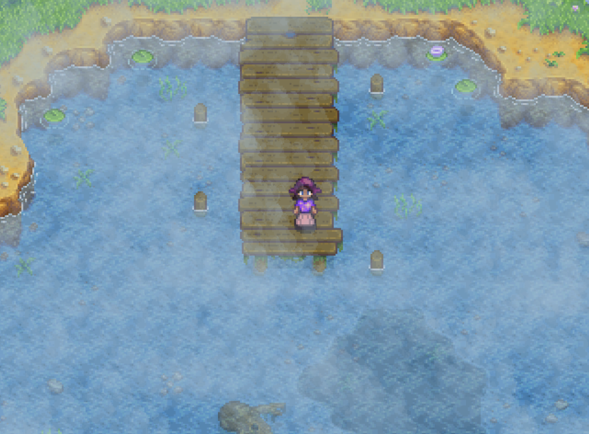
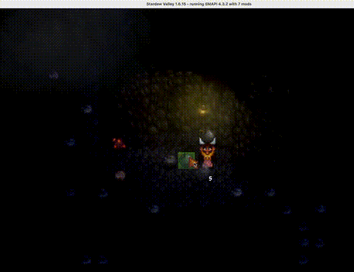

# Fog Mod for Stardew Valley

A mod that adds atmospheric fog effects to Stardew Valley, making the game world feel more immersive and mysterious.

## Installation

1. Install [SMAPI](https://smapi.io/)
2. Install [Generic Mod Config Menu](https://www.nexusmods.com/stardewvalley/mods/5098)
3. Download and extract this mod to your `Mods` folder
4. Run the game using SMAPI

## Building from Source

1. Make sure you have the [.NET 6.0 SDK](https://dotnet.microsoft.com/download/dotnet/6.0) installed.
2. Open a terminal in this mod's folder.
3. Run `dotnet build fog_mod.sln` to build the project.
4. The compiled mod will appear in the `bin/Debug/net6.0/` directory.
5. Copy the contents of that directory to your Stardew Valley `Mods` folder to test your build.

## Dependencies

- **SMAPI** 3.0.0 or higher
- **Generic Mod Config Menu** 1.0.0 or higher

## Credits

- **Author**: jakeetaylor
- **Game**: Stardew Valley by ConcernedApe
- **Modding Framework**: SMAPI by Pathoschild

## License

This mod is provided as-is for personal use. Please respect the original game's terms of service.

## Demo

A foggy day at the beach.

Foggin' up the caves.

Running through the nighttime fog.