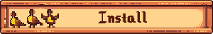
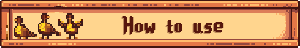
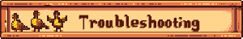
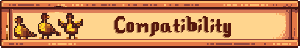
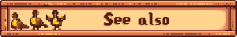

Chase grouse through foggy forests and work towards a new Adventurer Guild reward. Adds smoke to explosions for dramatic effect.

Install the latest version of SMAPI.
Download this mod and unzip it into Stardew Valley/Mods.
Run the game using SMAPI.

TODO

Please post issues [here](https://github.com/jakee417/Fog-Mod/issues).

- Compatible with Stardew Valley 1.6+ on Linux, macOS, and Windows.
- Works in single-player and multiplayer. It can safely be installed by any player (host or farmhand), even if other players don't have it.
- No known mod conflicts.

- [Source code](https://github.com/jakee417/Fog-Mod)
- [Release notes](https://github.com/jakee417/Fog-Mod/releases)
- Credit to Pathoschild for SMAPI and ConcernedApe for Stardew Valley